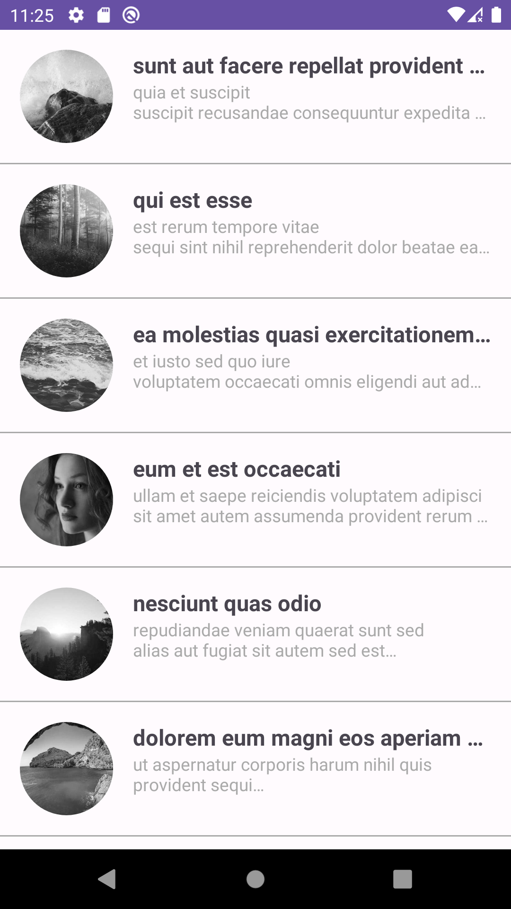
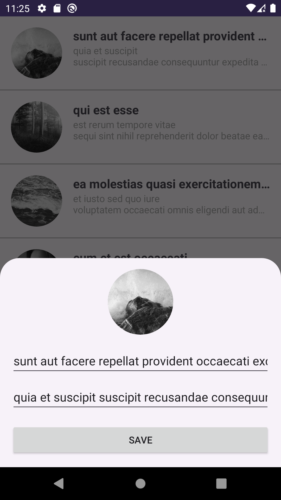
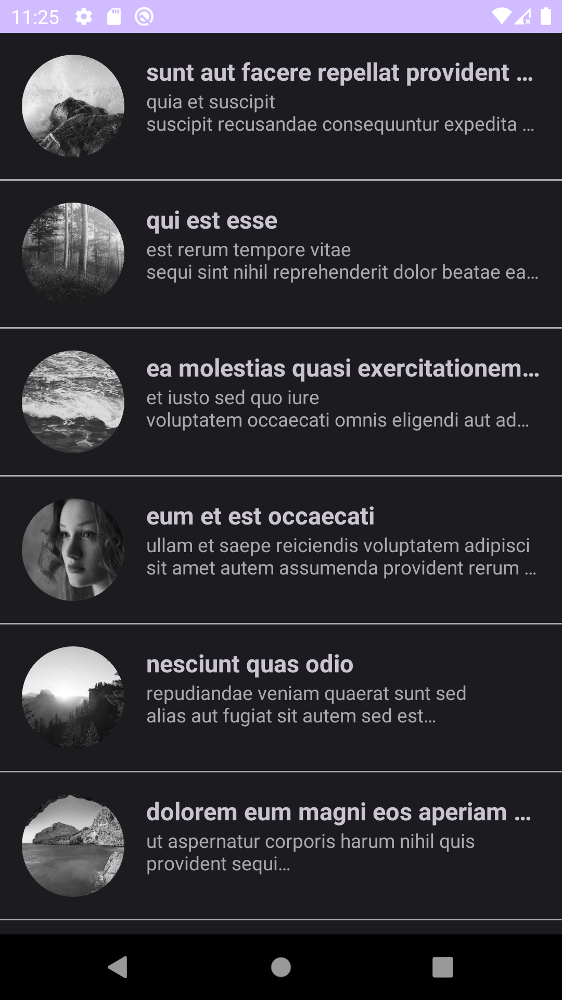
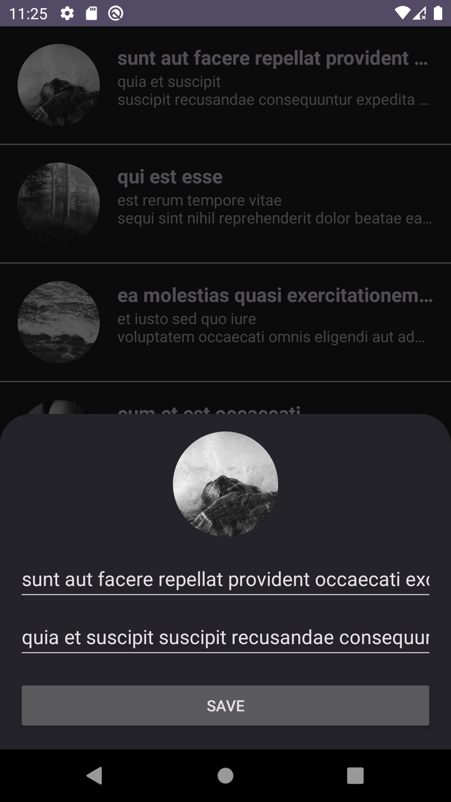

# ListingApp

ListingApp is a sample Android application that demonstrates the implementation of a simple listing feature. Users can view a list of items, update item details, delete items, and more. This project serves as a reference for Android app development and showcases best practices.

## Features

- Display a list of items.
- Swipe-to-refresh functionality.
- Swipe-to-delete functionality.
- Update item details.
- Clean architecture with MVVM pattern.
- Use of Hilt for dependency injection.
- Retrofit for network calls.
- RxJava for asynchronous operations.
- LiveData and Data Binding for UI updates.
- State management with ViewState and LiveData.
- RecyclerView with click and delete listeners.
- BottomSheetDialogFragment for item updates.
- Custom BindingAdapters for UI data binding.
- Custom ItemTouchHelper for swipe-to-delete.
- Dark Theme Support.

# API

- Posts: "https://jsonplaceholder.typicode.com/"
- Photos: "https://picsum.photos/" 

## Screenshots

### Prerequisites

- Android Studio (latest version)
- Android SDK with API level 21 or higher
- Git
